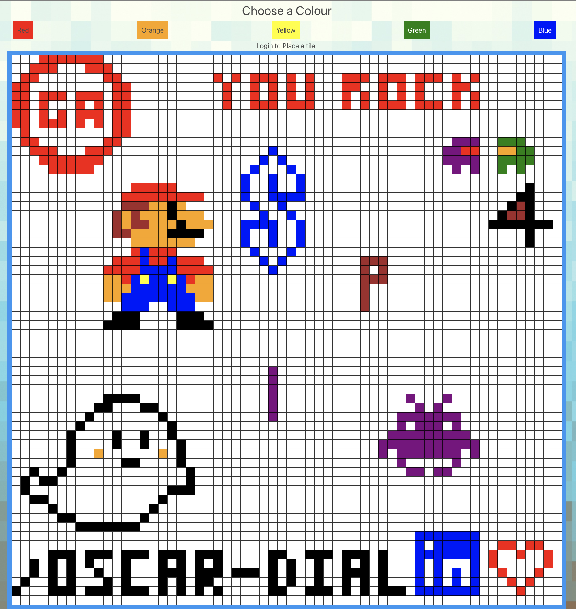

# Project Four - Pixelated
Team size: Alone

https://pixelperfectplace.netlify.app/

## Table of contents

<li>Project Overview</li>
<li>The Brief</li>
<li>Technologies Used</li>
<li>Approach Taken - (featured code)</li>
<li>Wins & Blockers</li>
<li>Bugs</li>
<li>Future Content and Improvements</li>
<li>Key Learnings</li>

## Project Overview 

For this project I drew inspiration from the 2017 and 2022 April Fools social experiment called 'Place' that reddit ran for 5 days. For those unfamiliar with the experiement here is the link the the 2022 reddit page (https://www.reddit.com/r/place/). This was my final project from the 3 month intensive softawre engineering bootcamp at General Assembly and by far my proudest final product. It was a solo project built over the span of about 2 weeks. In order to participate in my app you need to register with a new account, login and start placing one pixel at a time. The original experiment from Reddit had users waiting 5 minutes before placing another pixel but since this is low traffic website I decided not to but a timer.

## The Brief

<li>Build a full-stack application by making your own backend and your own front-end
<li>Use a Python Django API using Django REST Framework to serve your data from a Postgres database
<li>Consume your API with a separate front-end built with React
<li>Be a complete product which most likely means multiple relationships and CRUD functionality for at least a couple of models
<li>Be deployed online so it's publicly accessible.

## Technologies Used

### Backend:

<li>Python</li>
<li>Django</li>
<li>Django REST Framework</li>
<li>Psycopg2</li>
<li>Jsonwebtokens</li>
<li>dotenv</li>

### Frontend:

<li>React</li>
<li>Axios</li>
<li>Semantic UI React</li>
<li>SCSS</li>
<li>Http-proxy-middleware</li>
<li>Nodemon</li>
<li>React Router Dom</li>
<li>React Semantic UI Datepicker</li>
<li>Bulma</li>

### Development tools:

<li>VS code</li>
<li>Postman</li>
<li>Git</li>
<li>Github</li>
<li>Google Chrome dev tools</li>
<li>Heroku (deployment)</li>
<li>Trello Board (planning and timeline)</li>
<li>Excalidraw (wireframing)</li>
<li>Zoom</li>
<li>Slack</li>

## Approach Taken

### Day 1-10: Backend

My minimum viable product was to have a webiste with communities, threads and comments where people could potentailly discuss what drawings they would want to build together on the blank pixel canvas. Day 1 - 10 consisited building the models for the APIs. The Django models were, Color, Community, Thread, Comment, Pixel and the Custom User, displayed below.

    class Color(models.Model):
      color_name = models.CharField(max_length=30)
      def __str__(self):
        return f'Color: {self.color_name}'

    class Pixel(models.Model):
      x_axis = models.IntegerField(default= None)
      y_axis = models.IntegerField(default=None)
      color = models.ForeignKey(Color, related_name= 'color', on_delete= models.PROTECT, null=True)
      current_owner = models.ForeignKey(CustomUser, related_name='pixel', on_delete=models.PROTECT, null=True)
      number_of_times_changed = models.IntegerField(default=None)
      def __str__(self):
        return f'X axis = {self.x_axis} Y axis = {self.y_axis} Color = {self.color}'

    class Community(models.Model):
      creator = models.ForeignKey(CustomUser, related_name= 'community', on_delete=models.CASCADE, null=True)
      image = models.CharField(max_length=250)
      name = models.CharField(max_length=50, default=None)
      def __str__(self):
        return f'creator: {self.creator}...Community Name: {self.name}'

    class Comment(models.Model):
      thread = models.ForeignKey('Thread', related_name='thread', on_delete=models.CASCADE, null=True, blank=True)
      text = models.CharField(max_length=250)
      creator_of_comment = models.ForeignKey(CustomUser, related_name='creator', on_delete=models.CASCADE, null=True)
      def __str__(self):
        return f'creator of comment: {self.creator_of_comment} Comment: {self.text}'

    class Thread(models.Model):
      title = models.CharField(max_length=200)
      reply_thread = models.ForeignKey(Comment, related_name = 'comment', on_delete=models.CASCADE, null=True, blank=True)
      community = models.ForeignKey(Community, related_name='community', on_delete=models.CASCADE, null=True)
      def __str__(self):
        return f'Thread Title: {self.title} Community belonging: {self.community}'

    class CustomUser(AbstractUser):

      image = models.CharField(max_length=200, blank=True)

Possibly the most interesting model is the CustomUser model which inherited from the AbstractUser model pre-built with django. This was very new to me at the time and I had a couple issues understanding how to manipulate the elements inside the model. The Pixel model is also interesting since I wasn't sure how to build it considering it was going to be built around a square grid. I came to the conclusion that containing a x and y axis may be useful to keep track of data. 

Once I created the models I then serialized them so that they could be converted into Json format. I struggled with understanding how serialization worked, especially when differentiating between the CRUD operators. I used Postman a lot in these stages to test out my API. Once finished with all the models, authenticaition and serialization I deployed the API using heroku.

### Day 11 - 14: Frontend

Since I was more familiar with React and building the frontend I only spent about 3 days designing and linking the deployed backend to the React app. Possibly the hardest aspect of the project was building the 60 by 60 pixel grid. Once finished with the frontend and styling (although still a bit rudimentary) I deployed it to netlify.During my presentation to the class some classmates took the liberty to draw some amazing art work, Mario, Space Invader and Kirby the Ghost. Here is a picture of what the canvas looks like now*.

## Wins & Blocker

The biggest win for me was being able to convert on the idea I had originally planned out. Another win for me was bridging the knowledge gap I had when working on Django and the serliazation of the models. 

As to blockers, I had to rush the styling of the website which makes it look a bit simple. Another blocker is that the Pixel.js page inside the component folder is over 3500 lines long due to the thousands of pixels being displayed on screen. This make the page load a bit slow.

## Bugs

There are many bugs unfortunately with this website. The biggest issue is having the API data public which is currently being resolved. The second issue is that instead of updating a pixel, when you place a pixel it creates a new one and places it on top of the existing one. So instead of having a fixed amount of pixels, theoretically the number of pixels could be in the tens of thousands. At the moment, the loading time is very long which makes UX unpleasant.

## Future Content and Improvements

Besides fixing the bugs, another improvement I wish to work on is to add a zoom in and out ability to the grid as well as adding more pixels. One more piece of content I will add is adding notifications to when you fail to register due to lack of field requirements or invalid password confirmation/weak password.

Update (May 9th 2022):
I have implemented a pan and zoom in/out feature and an extra 40,000 pixels instead of 3600.

## Key Learnings

The most useful aspect of this project that I learnt from is manipulating the back-end with Django. I learnt how to serialize models and how the process differs from a populated model with foreign keys. I found Django to be very interesting and possibly the most intersting aspect of it was understand the AbstractUser model.